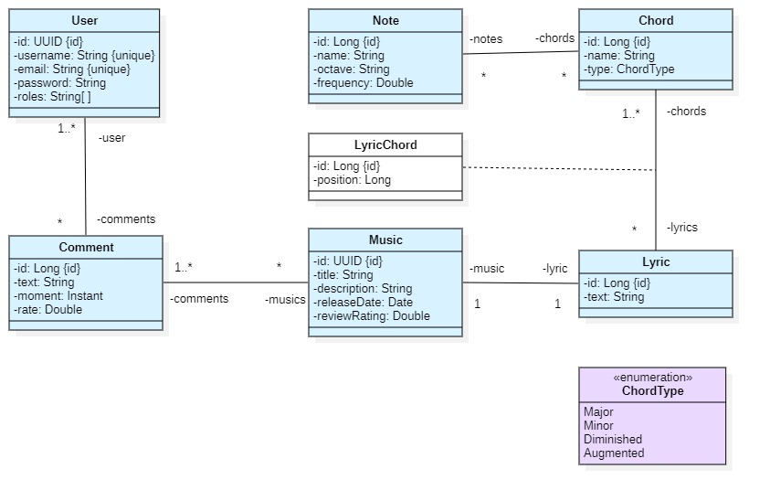
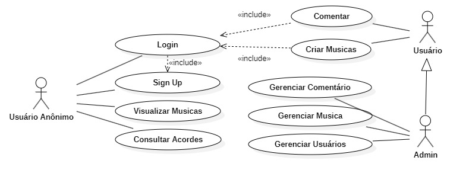

<h1 align="center">Tom Perfeito</h1>

 
    
    

## 🔍 Visão Geral

O **Tom Perfeito** é um **site** que tem como **objetivo** fornecer ao **usuário** uma **plataforma** onde seja possível consultar **acordes** montados a partir das **notas** selecionadas pelo próprio usuário, por meio de uma ​**interface interativa**​, além de apresentar **progressões** como forma de ​**auxílio**​.

O **sistema** também pretende permitir que o usuário crie suas próprias ​**músicas**​, possibilitando a escrita de **letras** e a inserção de **acordes** sobre elas, com **formatação personalizada** ou definida pelo próprio sistema.

## Índice

- 🧠 [Diagrama de Classe](#-diagrama-de-classe)
- 📝 [Caso de Uso](#-caso-de-uso)

- 💻 [Tecnologias utilizadas](#-tecnologias-utilizadas)
- 👥 [Autor](#-autor)

## 🧠 Diagrama de Classe

Este é o modelo conceitual do sistema "Tom Perfeito". Ele representa as  principais entidades e seus relacionamentos, servindo como base para a  construção do banco de dados e das classes de domínio da aplicação.

  

### Visão Geral

#### Composição Musical

* **Music & Lyric:** Cada **Música** possui exatamente uma ​**Letra**​. A música centraliza informações como descrição, data de lançamento e nota média (​*reviewRating*​).
* **Chord & Note:** Um **Acorde** é um conjunto de ​**Notas**​. O relacionamento é de muitos-para-muitos: um acorde tem várias notas, e uma nota pode compor diferentes acordes.
* **LyricChord (O "Onde"):** Classe que vincula o **Acorde** a um ponto específico da **Letra** através do atributo `position` (índice do texto).

#### Interação e Segurança

* **Comentários:**
  * **User & Comment:** Um **Usuário** é o autor de vários comentários (1:N).
  * **Music & Comment:** Uma **Música** recebe vários comentários (1:N).
* **Perfis (Roles):** O **Usuário** possui uma lista de permissões (ex: "USER", "ADMIN") que define o que ele pode acessar ou editar no sistema.

## 📝 Caso de Uso

  

### Atores

| Ator | Responsabilidade | 
|----------|----------|
| Usuário anônimo | Pode realizar casos de uso das áreas públicas do sistema, como visualizar musicas, consultar acordes por notas, login e sign up |
| Usuário | Responsável por manter seu próprios dados pessoais no sistema, e pode comentar, criar músicas e fazer todas as ações de um `Usuário anônimo`.| 
| Admin | Responsável por acessar a área administrativa do sistema com cadastros e relatórios. Admin também pode fazer tudo que Cliente faz. |

### Detalhamento

#### **Sign Up (Cadastro)**

* **Atores:** Usuário Anônimo.
* **Precondições:** Nenhuma.
* **Pós-condições:** Um novo ator do tipo `Usuário` é criado e logado no sistema.
* **Visão geral:** Permite que um usuário anônimo crie uma nova conta no sistema fornecendo dados como nome de usuário, e-mail e senha.

#### **Login**

* **Atores:** Usuário Anônimo.
* **Precondições:** O usuário deve possuir uma conta já cadastrada (`Sign Up`).
* **Pós-condições:** O ator `Usuário Anônimo` se torna um `Usuário` logado, ganhando acesso a funcionalidades restritas.
* **Visão geral:** Efetuar a autenticação no sistema para acessar funcionalidades personalizadas, como criar e gerenciar músicas.

#### **Consultar Acordes**

* **Atores:** Usuário Anônimo, Usuário, Admin.
* **Precondições:** Nenhuma.
* **Pós-condições:** Nenhuma.
* **Visão geral:** Permite  a qualquer pessoa que acesse o site montar acordes a partir de notas  selecionadas em uma interface interativa e visualizar informações sobre  eles. Também pode incluir a visualização de progressões de acordes  sugeridas.

#### **Visualizar Músicas**

* **Atores:** Usuário Anônimo, Usuário, Admin.
* **Precondições:** Nenhuma.
* **Pós-condições:** Nenhuma.
* **Visão geral:** Listar e visualizar as músicas públicas criadas por outros usuários, incluindo suas letras e cifras.

#### **Criar Músicas**

* **Atores:** Usuário.
* **Precondições:** Usuário deve estar logado (<<include>> Login).
* **Pós-condições:** Uma nova música é criada e associada ao perfil do usuário.
* **Visão geral:** Permite ao usuário criar uma nova música, definindo seu título, escrevendo a letra e inserindo os acordes sobre o texto.

#### **Comentar**

* **Atores:** Usuário.
* **Precondições:** Usuário deve estar logado (<<include>> Login).
* **Pós-condições:** Um novo comentário é associado a uma música.
* **Visão geral:** Permite que um usuário logado adicione um comentário em uma música existente.

#### **Gerenciar Música**

* **Atores:** Usuário, Admin.
* **Precondições:** Usuário deve estar logado.
* **Pós-condições:** A música pode ser alterada ou removida do sistema.
* **Visão geral:** Permite ao `Usuário` editar ou excluir suas próprias músicas. Permite ao `Admin` editar ou excluir qualquer música do sistema.

#### **Gerenciar Comentário**

* **Atores:** Usuário, Admin.
* **Precondições:** Usuário deve estar logado.
* **Pós-condições:** O comentário pode ser alterado ou removido do sistema.
* **Visão geral:** Permite ao `Usuário` editar ou excluir seus próprios comentários. Permite ao `Admin` moderar e excluir qualquer comentário.

#### **Gerenciar Usuários**

* **Atores:** Admin.
* **Precondições:** Usuário deve ser um `Admin` e estar logado.
* **Pós-condições:** O status ou os dados de um usuário podem ser alterados.
* **Visão geral:** CRUD  (Criar, Ler, Atualizar, Deletar) de usuários do sistema, incluindo a  capacidade de alterar papéis (promover para Admin) ou banir usuários.

## 💻 Tecnologias utilizadas

         

# 👥 Autor

| [ Ryan Oliveira](https://github.com/oryanend) |
| :---: |

