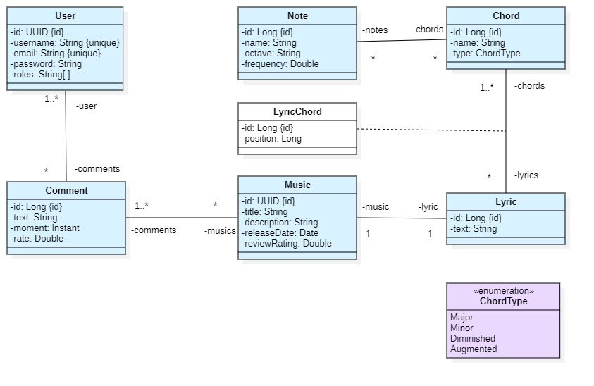
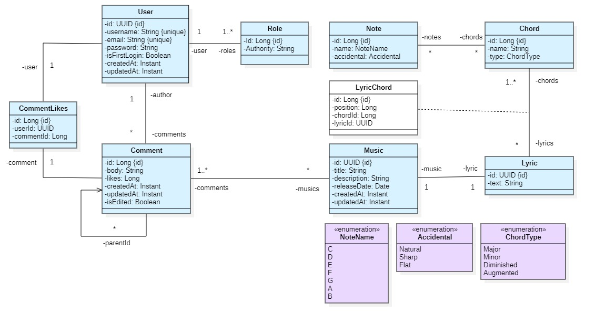
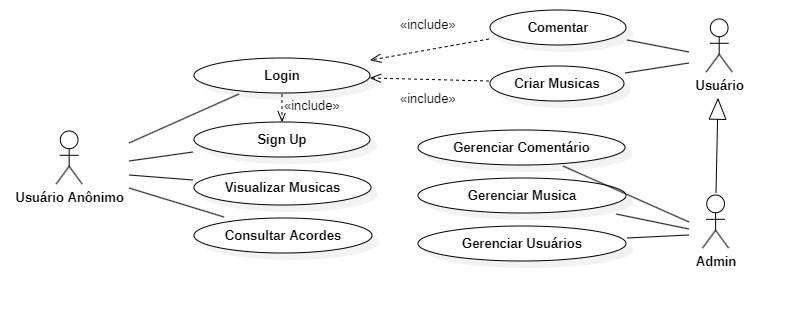
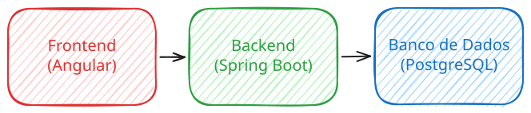
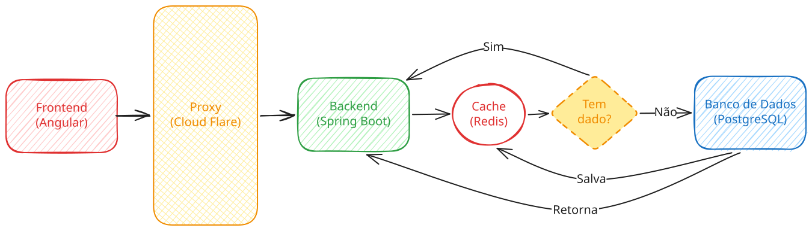
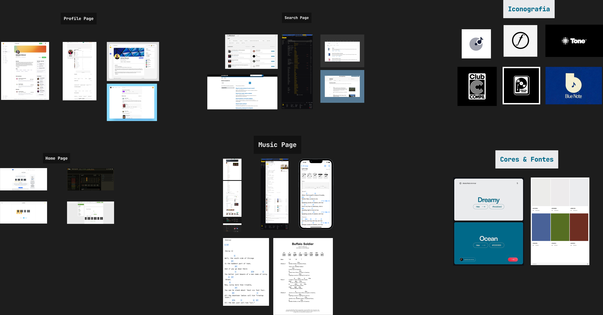
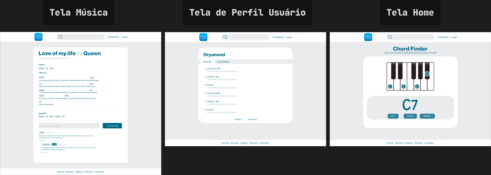
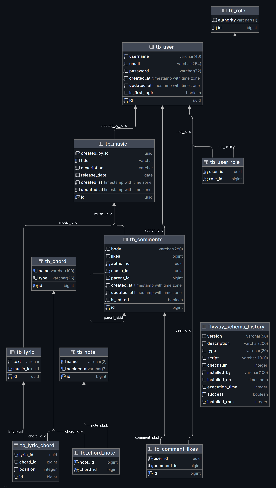

<h1 align="center">Tom Perfeito</h1>

  

    
    
    

## 🔍 Visão Geral

O **Tom Perfeito** é um **site** que tem como **objetivo** fornecer ao **usuário** uma **plataforma** onde seja possível consultar **acordes** montados a partir das **notas** selecionadas pelo próprio usuário, por meio de uma **interface interativa**.

O **sistema** também permite que o usuário crie suas próprias **músicas**, possibilitando a escrita de **letras** e a inserção de **cifras** sobre elas, com **formatação personalizada** ou definida pelo próprio sistema.

## Índice

- 🧠 [Diagrama de Classe](#-diagrama-de-classe)
- 📝 [Caso de Uso](#-caso-de-uso)
- 🌐 [Arquitetura do Sistema](#-arquitetura-do-sistema)
  - ⚙️ [Backend](#-backend)
  - 🎨 [Frontend](#-frontend)
  - 🛢️ [Banco de Dados](#-banco-de-dados)
- 💻 [Tecnologias utilizadas](#-tecnologias-utilizadas)
- 👥 [Autor](#-autor)

## 🧠 Diagrama de Classe

Uma das primeiras etapas do desenvolvimento deste projeto foi o planejamento, iniciado pela criação de um diagrama de classes. Até chegar ao modelo ideal, desenvolvi algumas versões. Este é o primeiro diagrama de classes do sistema Tom Perfeito, criado para representar as principais entidades e seus relacionamentos, servindo como base inicial para a estrutura do banco de dados e das classes de domínio, e evoluindo conforme os requisitos foram refinados.

  
<strong>Figura 01 - Diagrama de Classe Inicial</strong>

  

Mas, após pesquisas e análises ao longo do desenvolvimento, percebi que o modelo inicial não atendia completamente às necessidades do sistema. As principais lacunas eram a implementação de controle de acesso baseado em papéis (separando usuários comuns e administradores), a interação dos usuários com comentários e uma modelagem mais adequada de `Note` e `Chord`.

Por isso, o diagrama de classes foi revisado e aprimorado para refletir melhor a estrutura e as funcionalidades do sistema, resultando no modelo final apresentado abaixo:

  
<strong>Figura 02 - Diagrama de Classe Final</strong>

  

Agora, este é o modelo final do diagrama de classes do sistema Tom Perfeito, que representa de forma mais precisa as entidades. As principais mudanças são:

* Adição da classe `Role` para implementar o controle de acesso baseado em papéis (RBAC), permitindo a diferenciação entre usuários comuns e administradores.
* Inclusão de uma relação entre `Comment` e a própria `Comment`, possibilitando comentários aninhados, onde um comentário pode ser resposta a outro, utilizando o `parentId` como referência.
* Criação da classe `CommentLikes` para gerenciar as curtidas em comentários, permitindo que usuários curtam ou removam a curtida, com armazenamento estruturado dessas interações.
* Refinamento da classe `Note`, com uso de enums como `NoteName` e `Accidental` para representar notas musicais com mais precisão, além da classe `Chord`, que pode ser composta por várias notas, permitindo uma representação mais flexível dos acordes.

Esses foram alguns dos principais ajustes realizados no diagrama de classes para atender melhor às necessidades do sistema Tom Perfeito, garantindo uma estrutura mais robusta e adequada ao desenvolvimento da aplicação.

### Visão Geral

#### Composição Musical

* **Music & Lyric:** Cada **Música** possui exatamente uma **Letra** (relação 1:1). A música centraliza informações como título, descrição e data de lançamento.

* **Chord & Note:** Um **Acorde** é formado por um conjunto de **Notas**. Essa relação é muitos-para-muitos: um acorde pode conter várias notas, e uma nota pode estar presente em diferentes acordes. As notas possuem variações como sustenido e bemol (*Accidental*).

* **LyricChord (O "Onde"):** Classe responsável por associar um **Acorde** a um ponto específico da **Letra**, utilizando o atributo `position`. Além disso, mantém a referência tanto do acorde quanto da letra, permitindo mapear exatamente onde cada acorde aparece na música.

#### Interação e Conteúdo

* **Comentários:**

  * **User & Comment:** Um **Usuário** pode criar vários comentários (1:N), sendo identificado como autor.
  * **Music & Comment:** Uma **Música** pode possuir vários comentários (1:N), permitindo interação dos usuários.
  * **Comment (Hierarquia):** Comentários podem ter respostas, formando uma estrutura hierárquica através do `parentId`.

* **Curtidas em Comentários:**

  * **CommentLikes:** Representa a interação de usuários com comentários (likes), associando um usuário a um comentário específico.

#### Controle de Acesso

* **User & Role:** Um **Usuário** pode possuir múltiplas **Roles**, e cada role pode estar associada a vários usuários (relação muitos-para-muitos). As roles definem permissões dentro do sistema, como acesso administrativo ou padrão.

#### Auxiliares

* **Enums Musicais:**

  * **NoteName:** Define as notas musicais (C, D, E, F, G, A, B).
  * **Accidental:** Representa variações das notas (Natural, Sharp, Flat).
  * **ChordType:** Define o tipo do acorde (Major, Minor, Diminished, Augmented).

## 📝 Caso de Uso

  

### Atores

| Ator | Responsabilidade | 
|----------|----------|
| Usuário anônimo | Pode realizar casos de uso das áreas públicas do sistema, como visualizar musicas, consultar acordes por notas, login e sign up |
| Usuário | Responsável por manter seu próprios dados pessoais no sistema, e pode comentar, criar músicas e fazer todas as ações de um `Usuário anônimo`.| 
| Admin | Responsável por acessar a área administrativa do sistema com cadastros e relatórios. Admin também pode fazer tudo que Cliente faz. |

### Detalhamento

#### **Sign Up (Cadastro)**

* **Atores:** Usuário Anônimo.
* **Precondições:** Nenhuma.
* **Pós-condições:** Um novo ator do tipo `Usuário` é criado e logado no sistema.
* **Visão geral:** Permite que um usuário anônimo crie uma nova conta no sistema fornecendo dados como nome de usuário, e-mail e senha.

#### **Login**

* **Atores:** Usuário Anônimo.
* **Precondições:** O usuário deve possuir uma conta já cadastrada (`Sign Up`).
* **Pós-condições:** O ator `Usuário Anônimo` se torna um `Usuário` logado, ganhando acesso a funcionalidades restritas.
* **Visão geral:** Efetuar a autenticação no sistema para acessar funcionalidades personalizadas, como criar e gerenciar músicas.

#### **Consultar Acordes**

* **Atores:** Usuário Anônimo, Usuário, Admin.
* **Precondições:** Nenhuma.
* **Pós-condições:** Nenhuma.
* **Visão geral:** Permite  a qualquer pessoa que acesse o site montar acordes a partir de notas  selecionadas em uma interface interativa e visualizar informações sobre  eles. Também pode incluir a visualização de progressões de acordes  sugeridas.

#### **Visualizar Músicas**

* **Atores:** Usuário Anônimo, Usuário, Admin.
* **Precondições:** Nenhuma.
* **Pós-condições:** Nenhuma.
* **Visão geral:** Listar e visualizar as músicas públicas criadas por outros usuários, incluindo suas letras e cifras.

#### **Criar Músicas**

* **Atores:** Usuário.
* **Precondições:** Usuário deve estar logado (<<include>> Login).
* **Pós-condições:** Uma nova música é criada e associada ao perfil do usuário.
* **Visão geral:** Permite ao usuário criar uma nova música, definindo seu título, escrevendo a letra e inserindo os acordes sobre o texto.

#### **Comentar**

* **Atores:** Usuário.
* **Precondições:** Usuário deve estar logado (<<include>> Login).
* **Pós-condições:** Um novo comentário é associado a uma música.
* **Visão geral:** Permite que um usuário logado adicione um comentário em uma música existente.

#### **Gerenciar Música**

* **Atores:** Usuário, Admin.
* **Precondições:** Usuário deve estar logado.
* **Pós-condições:** A música pode ser alterada ou removida do sistema.
* **Visão geral:** Permite ao `Usuário` editar ou excluir suas próprias músicas. Permite ao `Admin` editar ou excluir qualquer música do sistema.

#### **Gerenciar Comentário**

* **Atores:** Usuário, Admin.
* **Precondições:** Usuário deve estar logado.
* **Pós-condições:** O comentário pode ser alterado ou removido do sistema.
* **Visão geral:** Permite ao `Usuário` editar ou excluir seus próprios comentários. Permite ao `Admin` moderar e excluir qualquer comentário.

#### **Gerenciar Usuários**

* **Atores:** Admin.
* **Precondições:** Usuário deve ser um `Admin` e estar logado.
* **Pós-condições:** O status ou os dados de um usuário podem ser alterados.
* **Visão geral:** CRUD  (Criar, Ler, Atualizar, Deletar) de usuários do sistema, incluindo a  capacidade de alterar papéis (promover para Admin) ou banir usuários.

## 🌐 Arquitetura do Sistema
Após a fase de planejamento, iniciei a implementação do sistema. Nesse primeiro momento, a aplicação foi estruturada com uma arquitetura simples, separada em frontend, backend e banco de dados:

    
<strong>Figura 03 - Arquitetura Inicial</strong>

    

Embora seja uma arquitetura funcional, ela não se mostrou adequada para o sistema, tendo em vista que o frontend e o backend estavam hospedados em serviços diferentes. Isso gerou uma série de problemas relacionados à comunicação entre os serviços, como CORS, autenticação e autorização, além de dificultar a escalabilidade e a manutenção do sistema.

Além disso, o backend estava hospedado no Render, o que impactava diretamente na performance: o tempo médio de resposta entre o backend e o banco de dados chegava a cerca de 160 ms e, após 15 minutos de inatividade, o servidor entrava em modo de hibernação, aumentando ainda mais a latência nas requisições iniciais. Com esses problemas, desenvolvi uma nova arquitetura mais complexa:

    
<strong>Figura 04 - Arquitetura Final</strong>

    

Com essa nova arquitetura, resolvi diversos problemas da aplicação, como:
* Reduzi o tempo de resposta entre o backend e o banco de dados em **92,08%** (de 116,07 ms para 9,19 ms) ao migrar o backend do Render para o Azure.
* Melhorei a comunicação entre frontend e backend, eliminando problemas de CORS, ao centralizar o DNS utilizando o Cloudflare.
* Reduzi o tempo de resposta de endpoints do backend em **10,1%** ao implementar cache com Redis e otimizar conexões com *connection pool* em estado idle ao usar a biblioteca HikariCP.

Sendo assim, a nova arquitetura do sistema mostrou-se mais robusta, escalável e eficiente, proporcionando uma melhor experiência para os usuários e facilitando a evolução e manutenção do sistema.

## ⚙️ Backend
O backend foi desenvolvido utilizando o framework Spring Boot, com Java como linguagem de programação. Ele é responsável por fornecer uma API RESTful ao frontend, gerenciar a lógica de negócio e interagir com o banco de dados PostgreSQL. Além disso, implementa autenticação e autorização, controle de acesso baseado em papéis (RBAC) e cache com Redis para melhorar a performance.

Os endpoints da API deste projeto são diversos, por isso estão organizados por seus respectivos controllers:

### **`AuthController`**

Responsável pelo registro e autenticação de usuários, retornando um JWT referente à sessão.

| Endpoint                         | Visão geral                                                   |
| -------------------------------- | ------------------------------------------------------------- |
| **POST** `/api/v1/auth/register` | Registra um novo usuário ao informar username, email e senha. |
| **POST** `/api/v1/auth/login`    | Autentica o usuário com email e senha, retornando um JWT.     |

---

### **`ChordController`**

Responsável por gerenciar acordes, permitindo listagem, busca e criação.

| Endpoint                                    | Visão geral                                          |
| ------------------------------------------- | ---------------------------------------------------- |
| **GET** `/api/v1/chords`                    | Retorna todos os acordes com paginação.              |
| **GET** `/api/v1/chords/search?name=x`      | Retorna acordes que contenham o nome `x`.            |
| **GET** `/api/v1/chords/search?notes=x,y,z` | Retorna acordes formados pelas notas `x`, `y` e `z`. |
| **POST** `/api/v1/chords`                   | Cria um novo acorde informando nome, tipo e notas.   |

---

### **`CommentController`**

Responsável pelo gerenciamento de comentários em músicas.

| Endpoint                                                      | Visão geral                                         |
| ------------------------------------------------------------- | --------------------------------------------------- |
| **GET** `/api/v1/musics/{musicId}/comments`                   | Retorna os comentários da música com paginação.     |
| **GET** `/api/v1/musics/{musicId}/comments/{id}`              | Retorna um comentário específico.                   |
| **POST** `/api/v1/musics/{musicId}/comments`                  | Adiciona um comentário à música.                    |
| **POST** `/api/v1/musics/{musicId}/comments/{commentId}/like` | Adiciona um like ao comentário (único por usuário). |
| **PATCH** `/api/v1/musics/{musicId}/comments/{id}`            | Atualiza o comentário (apenas o autor).             |
| **DELETE** `/api/v1/musics/{musicId}/comments/{id}`           | Remove o comentário (autor ou admin).               |

---

### **`MusicController`**

Responsável pelo gerenciamento de músicas.

| Endpoint                               | Visão geral                                                        |
| -------------------------------------- | ------------------------------------------------------------------ |
| **GET** `/api/v1/musics`               | Retorna todas as músicas com paginação.                            |
| **GET** `/api/v1/musics?name=x`        | Busca músicas pelo nome `x`.                                       |
| **GET** `/api/v1/musics/{id}`          | Retorna uma música específica.                                     |
| **GET** `/api/v1/musics/user/{userId}` | Retorna músicas criadas por um usuário.                            |
| **POST** `/api/v1/musics`              | Cria uma música com título, descrição, data de lançamento e letra. |
| **PATCH** `/api/v1/musics/{id}`        | Atualiza dados da música.                                          |
| **DELETE** `/api/v1/musics/{id}`       | Remove a música (autor ou admin).                                  |

---

### **`NoteController`**

Responsável pelo gerenciamento de notas musicais.

| Endpoint                 | Visão geral                               |
| ------------------------ | ----------------------------------------- |
| **GET** `/api/v1/notes`  | Retorna todas as notas.                   |
| **POST** `/api/v1/notes` | Cria uma nota informando nome e acidente. |

---

### **`UserController`**

Responsável pelas operações relacionadas ao usuário.

| Endpoint                                 | Visão geral                                   |
| ---------------------------------------- | --------------------------------------------- |
| **GET** `/api/v1/users/me`               | Retorna o usuário autenticado (via JWT).      |
| **GET** `/api/v1/users/{id}`             | Retorna um usuário pelo ID.                   |
| **PATCH** `/api/v1/users/me/first-login` | Atualiza o campo `isFirstLogin` para `false`. |

---

### **Outros Controllers**

Alguns controllers são utilizados para funcionalidades específicas do sistema:

* **`StatusController`**: Retorna o status do servidor e do banco de dados.
* **`CacheController`**: Responsável por invalidar caches antigos.
* **`UserCommentController`**: Retorna os comentários feitos por um usuário.

### 🔐 Segurança e Modelagem

#### **Decisões de Modelagem (Diagrama de Classes)**

Durante a evolução do diagrama de classes, algumas decisões foram tomadas visando segurança, escalabilidade e boas práticas:

* **Uso de Email e Senha para autenticação:**
  A autenticação foi definida utilizando **email e senha**, em vez de username e senha, por ser mais segura. Caso um atacante tente acessar uma conta utilizando username, ele já possui metade da informação necessária. Com email, essa previsibilidade é reduzida.

* **Uso de UUID como identificador:**
  Foi adotado **UUID** em vez de IDs sequenciais (`long`), evitando previsibilidade e dificultando ataques como enumeração de usuários (ex: tentar acessar `/users/1`, `/users/2`, etc.).

* **Limite de 40 caracteres para username:**
  O tamanho do username foi limitado para evitar abusos, como entradas excessivamente longas que podem ser utilizadas em ataques (ex: exploração de memória ou sobrecarga em requisições).

* **Senha sem tamanho máximo definido:**
  Não foi definido um limite máximo para senhas, pois o BCrypt considera apenas os primeiros 72 caracteres. Ou seja, senhas maiores que isso têm o excedente ignorado, não trazendo ganho real de segurança ao aumentar o tamanho além desse limite.

---

#### **Segurança da Aplicação**

O sistema implementa diversas camadas de segurança:

* **JWT (JSON Web Token):**
  Utilizado para autenticação stateless. Após o login, o backend gera um token que é enviado pelo cliente em cada requisição protegida, permitindo a identificação do usuário.

* **Validação de usuário (autorização):**
  O sistema garante que um usuário só pode modificar seus próprios dados (ex: comentários), validando o ID presente no token JWT com o recurso sendo acessado. Ações administrativas são controladas via **RBAC (Roles)**.

* **CORS (Cross-Origin Resource Sharing):**
  Configurado para permitir comunicação segura entre frontend e backend, evitando bloqueios indevidos e prevenindo acessos não autorizados entre origens diferentes.

* **Hash de senha com BCrypt:**
  As senhas são armazenadas de forma segura utilizando **BCrypt**, um algoritmo de hashing com *salt* automático.

  * Durante os testes, foi ajustado o nível de *strength* (rounds) para **4** no ambiente de desenvolvimento, reduzindo o tempo de execução dos testes:

    * Antes: **12s 216ms**
    * Depois: **5s 17ms**
    * Redução de aproximadamente **58,9%** no tempo de testes

  Essa configuração é utilizada apenas em ambiente de teste, mantendo níveis mais altos em produção para garantir segurança.

## 🎨 Frontend
O frontend foi desenvolvido utilizando o framework Angular, com TypeScript como linguagem de programação. Ele é responsável por fornecer a interface do usuário, consumir a API do backend e gerenciar a experiência do usuário. A aplicação está hospedada na Vercel, garantindo alta disponibilidade e boa performance.

Uma das partes que recebeu mais atenção durante o desenvolvimento foi o design da interface, com foco em proporcionar uma experiência intuitiva e agradável; para isso, desenvolvi um board de referências com exemplos de sites do mesmo segmento, que serviram de inspiração para a definição do layout e da experiência do usuário:

  
<strong>Figura 05 - Board de Referências</strong>

  
  
    <a href="https://www.figma.com/design/Icz3U6URREmuEhuoiCnFDf/Tom-Perfeito?node-id=98-2&p=f&t=5C1WkYvU8EdZUs8q-0" target="_blank">Veja imagem completa</a>
  

Utilizei diversos sites de referência, como Cifra Club, Ultimate Guitar e Oolimo, para entender melhor a construção de uma plataforma de músicas, cifras e acordes. Com base nisso, desenvolvi uma prototipação no Figma, onde defini o layout e a estrutura do sistema, chegando ao seguinte resultado:

  
<strong>Figura 06 - Protótipo do Frontend</strong>

  
  
    <a href="https://www.figma.com/design/Icz3U6URREmuEhuoiCnFDf/Tom-Perfeito?node-id=0-1&p=f" target="_blank">Veja todas as telas no Figma</a>
  

Essa base serviu como ponto de partida para o design do frontend, que evoluiu ao longo de diversas iterações durante o desenvolvimento; embora o sistema atual esteja mais refinado, ele ainda segue esses fundamentos, resultando em uma interface moderna, responsiva e fácil de usar, proporcionando uma experiência consistente e intuitiva para os usuários do sistema Tom Perfeito.

## 🛢️ Banco de Dados
O banco de dados utilizado é o PostgreSQL, com o Neon como provedor em ambiente de produção. Atualmente, o banco de dados possui as seguintes tabelas:

  
<strong>Figura 07 - Representação do Banco de Dados</strong>

  

O backend insere dados iniciais no banco por meio de *migrations*, utilizando o Flyway. Entre as principais tabelas com dados pré-carregados estão:

* `tb_note`: insere as 12 notas musicais (C, C#, D, D#, E, F, F#, G, G#, A, A#, B).
* `tb_role`: insere as roles `ROLE_USER` e `ROLE_ADMIN`, utilizadas no controle de acesso baseado em papéis (RBAC).
* `tb_chord`: insere alguns acordes pré-definidos, como C major, D minor e E major.

Dessa forma o banco de dados já possui uma base inicial de dados para o sistema, permitindo que as funcionalidades sejam testadas e utilizadas desde o início do desenvolvimento, sem a necessidade de inserir manualmente esses dados essenciais para o funcionamento do sistema Tom Perfeito.

## 💻 Tecnologias utilizadas
 
                

# 👥 Autor

| [ Ryan Oliveira](https://github.com/oryanend) |
| :---: |

